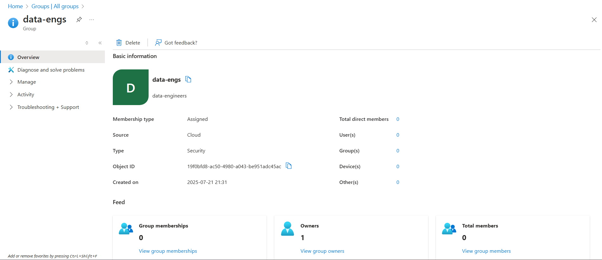

# Azure End-to-End Data Engineering Real-Time Project

This project is a complete data pipeline solution I developed to simulate a real-world business scenario. It helped deepen my understanding of cloud-based data engineering and analytics workflows.

---

## Project Overview

In this project, I built an end-to-end data pipeline using various Azure services to solve a business problem centered around customer insights and sales analytics. The objective was to extract customer and sales data from an on-prem SQL Server database, process and transform it in the cloud, and create a Power BI dashboard that delivers meaningful insights. The dashboard focuses on key metrics such as sales by gender and product category, allowing for detailed filtering by product, gender, and time.

---

## Business Requirements

The business aims to better understand its customer base—particularly the gender split—and how different demographics influence purchasing behavior. The key goals included:

- **Sales by Gender, Country and Product Category:** Visualizing total product sales, total revenue, costs, profits and gender breakdown.
- **Data Filtering:** Enabling filtering by product category, gender, and location.
- **User-Friendly Dashboard:** Ensuring a simple interface for stakeholders to explore insights easily.

---

## Solution Overview

To meet these goals, I broke the solution into the following main components:

### 1. **Data Ingestion**

- I extracted customer and sales data from a local SQL Server database.
- Using Azure Data Factory (ADF), I loaded the raw data into Azure Data Lake Storage (ADLS).

### 2. **Data Transformation**

- I processed and transformed the raw data using Azure Databricks.
- The data was structured into Bronze (raw), Silver (cleaned), and Gold (aggregated) layers within ADLS.

### 3. **Data Loading and Reporting**

- I loaded the curated Gold data into Azure Synapse Analytics.
- From Synapse, I connected Power BI to create an interactive dashboard for data visualization.

### 4. **Automation**

- I configured ADF to run the entire pipeline on a daily schedule, keeping data and reports fresh.

---

## Technology Stack

- **Azure Data Factory (ADF):** For orchestrating data flow and transformations.
- **Azure Data Lake Storage (ADLS):** Used as a storage layer for raw and processed data.
- **Azure Databricks:** For performing transformations using notebooks.
- **Azure Synapse Analytics:** For SQL-based analytics and data warehousing.
- **Power BI:** For creating dashboards and visual reports.
- **Azure Key Vault:** For managing secrets and credentials securely.
- **SQL Server (On-Premises):** Source system for sales and customer data.

---

## Setup Instructions

### Prerequisites

- A valid Azure subscription.
- Access to an on-premises SQL Server with the AdventureWorks database installed.

---

### Step 1: Azure Environment Setup

- I started by creating a dedicated resource group in Azure.
- Then I provisioned the required services:
  - Azure Data Factory
  - Azure Data Lake Storage (with Bronze, Silver, and Gold containers)
  - Azure Databricks and Synapse Analytics workspaces
  - Azure Key Vault for managing secrets

---

### Step 2: Data Ingestion

- I restored the AdventureWorks database to my local SQL Server.
- Then I created ADF pipelines to move the data from SQL Server into the Bronze container in ADLS.

---

### Step 3: Data Transformation

- I mounted the ADLS containers inside Azure Databricks.
- Using notebooks, I cleaned and transformed the data step-by-step:
  - Bronze → Silver → Gold layers

---

### Step 4: Data Loading and Reporting

- I set up a dedicated SQL pool in Synapse and loaded the Gold-layer data.
- I connected Power BI to Synapse and created visualizations according to the business goals.

---

### Step 5: Automation and Monitoring

- I scheduled the ADF pipelines to run daily.
- I also used ADF’s built-in monitoring tools to keep track of pipeline runs and troubleshoot any failures.

---

### Step 6: Security and Governance

- I configured role-based access control (RBAC) using Azure Entra ID to ensure secure access to resources.

---

### Step 7: End-to-End Testing

- I tested the full pipeline by running a scheduled daily trigger after inserting new records into the SQL Server database and verifying that they appeared in the final Power BI dashboard after the scheduled run.

---

## Conclusion

This end-to-end project simulates a real-world data engineering workflow using Azure’s modern toolset. It helped me understand how to build scalable, automated pipelines and derive insights that empower business decision-making. The result is a live dashboard that continuously updates and enables stakeholders to monitor gender-based trends and product sales performance in real time.
